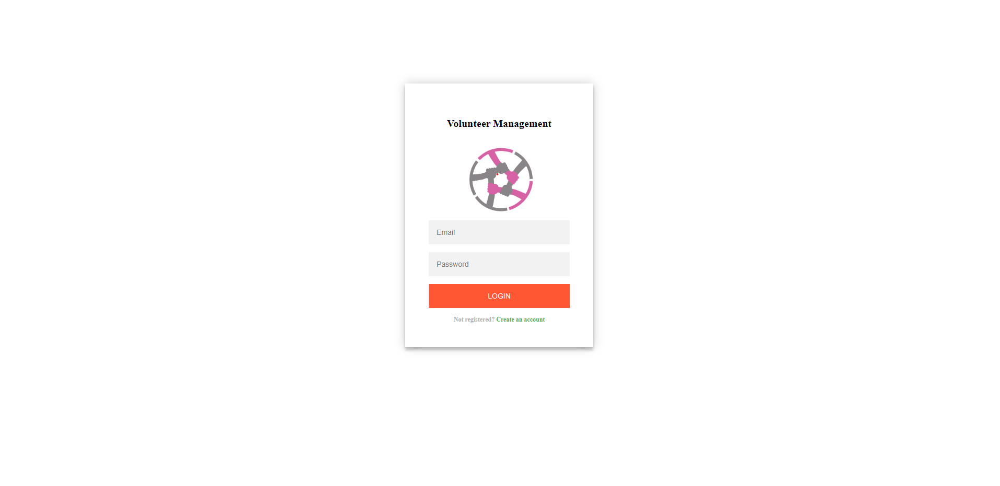
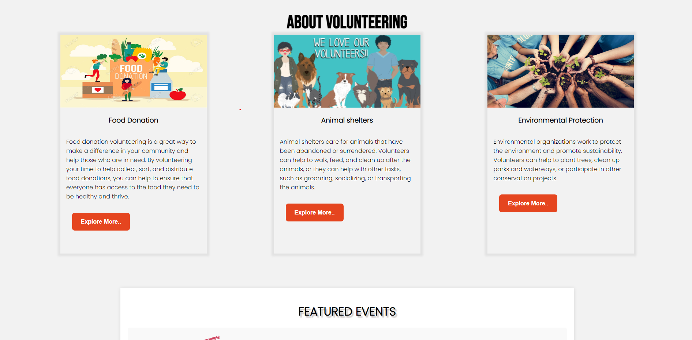

# Volunteer_Management System
VolunteerManagement is a web application built with Node.js, Express, EJS, MongoDB, and CSS. It provides a platform for users to create and discover volunteer events, fostering community engagement and social impact. Users can easily create events where they need volunteers and other users can join those events to contribute their time and efforts.

## Features

- User Authentication: Users can sign up and log in using Firebase Authentication.
- Create Volunteer Events: Authenticated users can create and manage volunteer events.
- Dynamic Event Listing: Events created by users are dynamically displayed on the homepage.
- Contact Us: Users can send messages about any queries or issues through the Contact Us page, which is also connected to Firebase.

## Technologies Used

- Firebase: Used for user authentication, real-time database, and hosting.
- HTML/CSS/JavaScript: The frontend is built using these web technologies.
  Ejs Node js for backend.

  ## Output Screenshots
  ### Login page
  

  ### Home page
  
  

  
  

